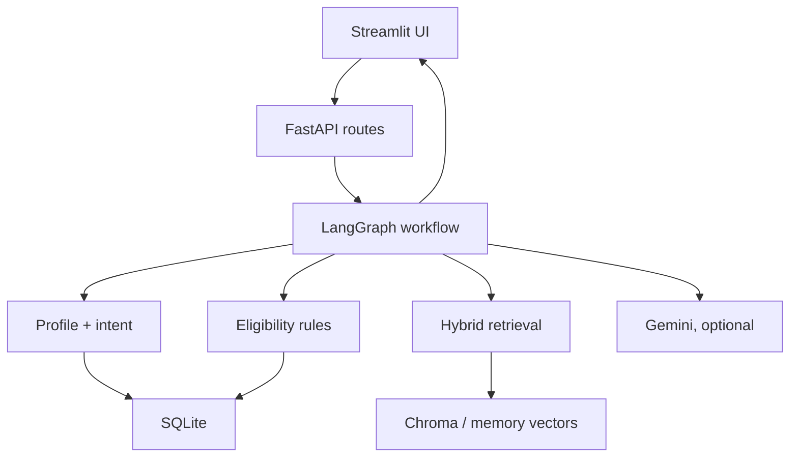
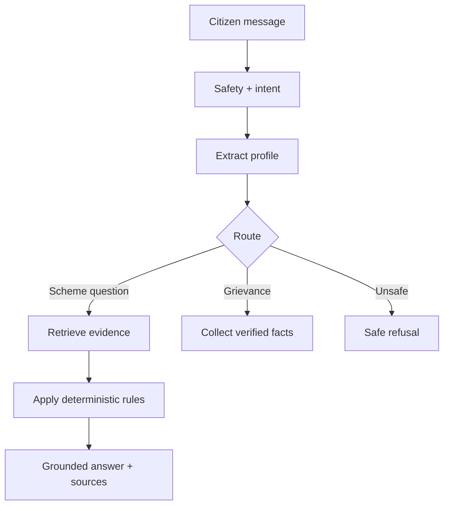

# JanScope AI

JanScope AI is a source-grounded citizen-assistance application for discovering Indian government schemes, checking **provisional** eligibility through deterministic rules, answering questions with RAG, supporting English/Hindi/Hinglish, and preparing grievance drafts for human review.

It is a BTech/placement project—not a government system. It never guarantees eligibility or submits a grievance.

## Key features

- FastAPI REST backend with Swagger
- Full Streamlit dashboard integrated with the backend
- Local SQLite persistence for schemes and conversations
- Citizen-profile extraction from English, Hindi and Hinglish text
- Deterministic, explainable eligibility engine
- Hybrid keyword + vector retrieval
- ChromaDB persistent vector store with a no-download hashing embedder
- LangChain documents and text splitting
- LangGraph conditional workflow with a deterministic fallback
- Optional Gemini generation using the official Google GenAI SDK
- No-key demo mode
- Grounded answers with numbered source citations
- Clarification questions for missing profile information
- English/Hindi grievance drafts with human-review requirement
- Prompt-injection detection, input bounds, abstention and privacy-safe logs
- Pytest API, workflow, retrieval and safety tests
- Repeatable 25-question golden-dataset evaluation
- Docker and Docker Compose
- Windows one-click setup and run scripts
- Postman collection and beginner documentation

## Architecture



## Request workflow



## Technology stack

| Layer | Technology |
|---|---|
| Backend | Python 3.13/3.12, FastAPI, Uvicorn |
| Validation | Pydantic |
| Database | SQLite, SQLAlchemy 2 |
| RAG | LangChain text splitting, custom hashing embeddings |
| Vector store | ChromaDB with memory fallback |
| Workflow | LangGraph with deterministic fallback |
| LLM | Gemini through Google GenAI SDK, optional |
| Frontend | Streamlit, HTTPX |
| Testing | Pytest, FastAPI TestClient |
| Packaging | Docker, Docker Compose, Windows batch files |

## Quick start

Read [START_HERE.md](START_HERE.md). On Windows:

```bat
setup.bat
run_all.bat
```

Then open:

- Frontend: <http://127.0.0.1:8501>
- Swagger: <http://127.0.0.1:8000/docs>

## Important API endpoints

| Method | Endpoint | Purpose |
|---|---|---|
| GET | `/api/v1/health` | Service and mode status |
| GET | `/api/v1/schemes` | Browse/filter schemes |
| GET | `/api/v1/schemes/{slug}` | Scheme details |
| POST | `/api/v1/profile/extract` | Extract provided citizen attributes |
| POST | `/api/v1/auth/request-otp` | Request an email verification code |
| POST | `/api/v1/auth/verify-otp` | Verify the code and create an account session |
| POST | `/api/v1/auth/logout` | Revoke the current account session |
| POST | `/api/v1/eligibility/check` | Explain provisional eligibility |
| POST | `/api/v1/documents/ingest` | Chunk and index a scheme document |
| POST | `/api/v1/documents/ingest-file` | Extract and index PDF/TXT/Markdown |
| POST | `/api/v1/chat` | Run the complete JanScope workflow |
| POST | `/api/v1/grievances/draft` | Create a reviewable draft |
| GET | `/api/v1/conversations/{id}` | Read local conversation history |

## Demo versus Gemini mode

| Capability | Demo mode | Gemini mode |
|---|---:|---:|
| Backend/frontend | Yes | Yes |
| SQLite and Chroma | Yes | Yes |
| Rule profile extraction | Yes | Yes |
| Deterministic eligibility | Yes | Yes |
| LangGraph workflow | Yes | Yes |
| Template grounded answer | Yes | Fallback |
| Natural grounded generation | No | Yes |
| AI-assisted profile enrichment | No | Yes |
| AI grievance wording | No | Yes |

The application automatically returns to a safe deterministic response if Gemini is disabled or its request fails.

## Dataset design

`data/schemes.json` is a small curated demonstration dataset with official portal URLs and a `last_verified` field. Encoded rules are only the machine-checkable subset. A production system would require automated freshness checks, complete official guidelines, human review, legal/privacy assessment and authenticated administrative updates.

## Test

```bash
python -m pytest -q
```

Run the repeatable demo evaluation:

```bash
python scripts/evaluate.py
```

See `EVALUATION.md` for the measured smoke results and their limitations.

## Docker

Create `.env`, then run:

```bash
docker compose up --build
```

Open <http://localhost:8501>.

## Public deployment security

Use `.env.production.example` as the production configuration checklist and store all real secrets in the hosting provider's encrypted environment settings. Production startup fails when the conversation-signing secret is weak or CORS still permits localhost.

- `/api/v1/chat` and `/api/v1/grievances/draft` are rate-limited per client address.
- Document ingestion is disabled by default. To operate it privately, set `INGESTION_ENABLED=true`, configure a strong `ADMIN_API_KEY`, and send it only in the `X-Admin-Key` header.
- Conversation continuation and history require the signed token returned by the first chat response.
- Request sizes, profile field lengths, attachment counts, CORS origins, API documentation, and proxy trust are environment-controlled.
- API responses include restrictive browser security headers, and application logs contain route templates rather than message bodies, personal details, or conversation identifiers.

The built-in limiter is intentionally single-process. For multiple backend replicas, enforce shared rate limits with Redis, a reverse proxy, or the hosting provider's API gateway.

### Passwordless email OTP

The welcome page offers Login, Create account, and Demo access. Local development uses `OTP_DELIVERY_MODE=development` and displays the short-lived code on screen. Production deliberately refuses to start with this mode.

For deployment, set `OTP_DELIVERY_MODE=smtp`, generate a unique `OTP_SECRET`, and add the SMTP values shown in `.env.production.example`. A free-tier SMTP provider can be used for a low-traffic project. Codes expire after 10 minutes, attempts are limited, only code hashes are stored, and issued session tokens can be revoked at logout. Never commit SMTP credentials to GitHub.

## Live official scheme synchronization

JanScope can incrementally cache public scheme pages from the official myScheme sitemap. It only fetches allowlisted government hosts, checks `robots.txt`, uses bounded batches and delays, stores the source URL and verification date, and refreshes the retrieval index. Gemini explains the cached official content; it is never treated as the source of scheme facts.

Enable `LIVE_SOURCE_SYNC_ENABLED=true` and set a strong `ADMIN_API_KEY`. The backend then runs a bounded sync on startup and every `LIVE_SYNC_INTERVAL_HOURS`. You can also run:

```powershell
.venv\Scripts\python.exe scripts\sync_official_sources.py --max-pages 25
```

Or call `POST /api/v1/admin/sources/myscheme/sync` with the admin key in `X-Admin-Key`. Increase the batch gradually rather than crawling the entire catalogue at once.

## Project ownership and interview readiness

Treat this generated repository as a reference implementation first. To honestly own it, you should be able to:

1. Trace `POST /api/v1/chat` from Streamlit to the database and back.
2. Explain why eligibility is deterministic rather than fully LLM-generated.
3. Build a tiny hashing/cosine retrieval program yourself.
4. Add one profile field and one scheme rule.
5. Modify a LangGraph route.
6. Diagnose a failed test and API error.
7. Replace or add a scheme document and rebuild the index.
8. Explain limitations without claiming government-grade accuracy.

## Resume description

> Built an agentic RAG-based citizen-assistance platform using FastAPI, Streamlit, LangChain, LangGraph, ChromaDB and Gemini, with source-grounded scheme discovery, deterministic eligibility checks, Hindi/Hinglish support, conversational memory and human-reviewed grievance drafting.

## Safety and limitations

- This is not affiliated with the Government of India or any state government.
- Eligibility results are provisional and cover only encoded rules.
- Scheme information can change after the dataset verification date.
- Bank loans, scholarships and government benefits require official verification and approval.
- Avoid entering unnecessary Aadhaar numbers, bank account numbers or sensitive identifiers.
- Grievance text must be reviewed by the applicant before submission.
