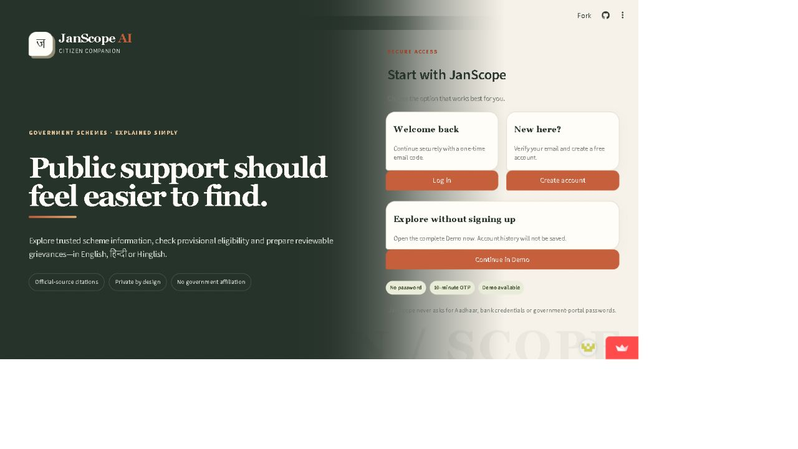
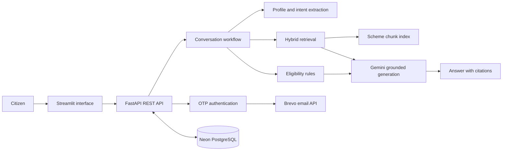
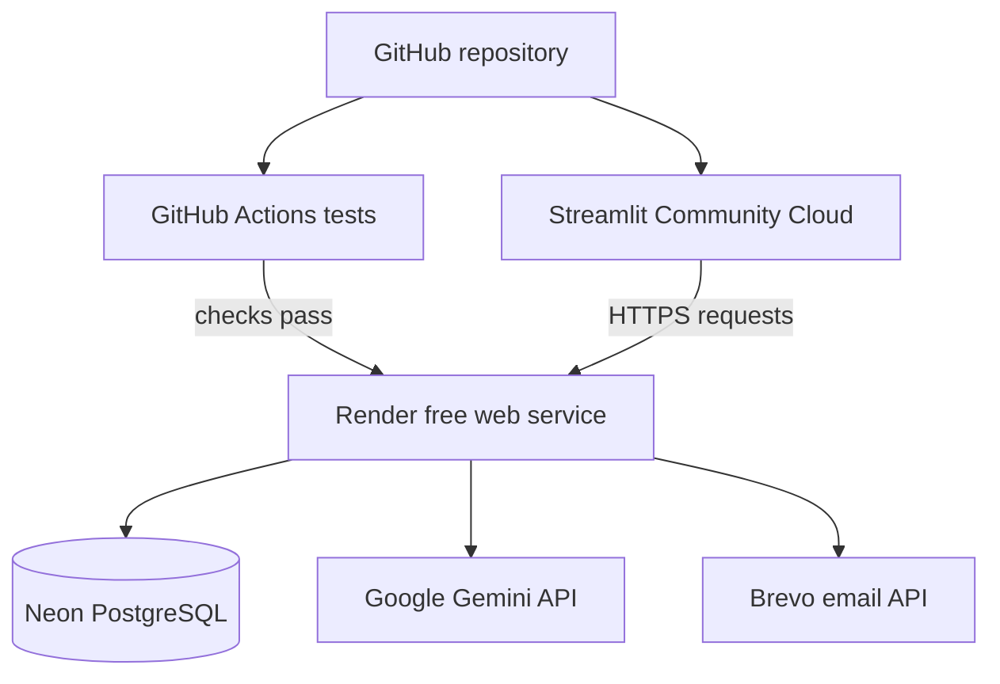

# JanScope AI

JanScope AI is a deployed government-scheme discovery assistant for Indian citizens. It combines source-grounded retrieval, preliminary rule-based eligibility checks and a conversational interface to make official scheme information easier to explore.

The project is an independent student-built application. It is not affiliated with the Government of India and does not make final eligibility or approval decisions.

[Open the live application](https://janscope.streamlit.app/) | [Backend health check](https://janscope-api.onrender.com/api/v1/health)



## What the application does

- Searches a catalog of 34 government schemes collected from official sources
- Answers scheme questions through a lightweight Retrieval-Augmented Generation (RAG) pipeline
- Shows numbered citations and official application links with generated answers
- Performs explainable preliminary eligibility checks using encoded profile rules
- Supports English, Hindi and Hinglish conversations
- Extracts useful profile details from natural-language messages
- Creates grievance drafts that the citizen can review before using
- Provides passwordless account access through email OTP verification
- Preserves user and conversation data in PostgreSQL
- Continues with deterministic fallback responses if the Gemini API is unavailable
- Works on desktop and mobile layouts

## How it works



For a scheme question, JanScope builds a retrieval query from the message and the available citizen profile. It searches indexed scheme chunks using lexical relevance and vector similarity, runs deterministic checks where rules are encoded, and supplies the retrieved evidence to Gemini. The model is instructed to use only that evidence, mark eligibility as provisional and cite the supplied sources.

If generation is disabled or fails, the same retrieved schemes and rule results are returned through a deterministic template instead of failing the entire request.

## RAG implementation

JanScope uses a deliberately lightweight RAG design that can run on free hosting:

1. Scheme records are converted into documents containing descriptions, benefits, application steps, required documents, official URLs and verification dates.
2. Documents are divided into overlapping chunks using LangChain text splitters, with a local fallback splitter.
3. A no-download hashing embedder converts the chunks and incoming query into numeric vectors.
4. Retrieval combines vector similarity, keyword overlap, scheme-name relevance and state relevance.
5. The highest-scoring evidence is inserted into a constrained Gemini prompt.
6. The response includes numbered citations linked to official sources.

The production deployment currently uses an in-memory vector index because it is small and inexpensive to rebuild. ChromaDB support is available for local persistent vector storage. A larger deployment could replace this with neural embeddings and pgvector or a managed vector database.

## Technology stack

| Area | Technology |
|---|---|
| Language | Python |
| Backend | FastAPI, Uvicorn, Pydantic |
| Frontend | Streamlit, custom responsive CSS, HTTPX |
| Database | PostgreSQL on Neon, SQLAlchemy 2, psycopg |
| Retrieval | Hybrid lexical/vector search, hashing embeddings |
| RAG utilities | LangChain documents and text splitters |
| Workflow | LangGraph with deterministic fallback |
| Generative AI | Google Gemini through the Google GenAI SDK |
| Authentication | Email OTP, signed sessions, Brevo HTTPS API |
| Deployment | Docker, Render, Streamlit Community Cloud |
| Testing and CI | Pytest, FastAPI TestClient, GitHub Actions |

## Current deployment



- **Frontend:** [janscope.streamlit.app](https://janscope.streamlit.app/)
- **Backend:** [janscope-api.onrender.com](https://janscope-api.onrender.com/)
- **Database:** Neon PostgreSQL
- **Email delivery:** Brevo transactional email API
- **Deployment branch:** `main`
- **Deployment gate:** Render deploys after GitHub Actions passes

The backend uses Render's free instance, so its first request after inactivity can take roughly a minute while the service starts. This is expected free-tier behavior rather than an application error.

## Project structure

```text
JanScope-AI/
|-- app/
|   |-- api/              # FastAPI routes
|   |-- core/             # configuration and security
|   |-- db/               # database models and sessions
|   |-- repositories/     # persistence operations
|   |-- services/         # retrieval, AI, auth and workflow logic
|   `-- main.py           # FastAPI application entry point
|-- frontend/
|   `-- streamlit_app.py  # public web interface
|-- data/
|   `-- schemes.json      # verified seed catalog
|-- scripts/              # evaluation and official-source utilities
|-- tests/                # API, workflow, retrieval and safety tests
|-- render.yaml           # Render deployment definition
|-- Dockerfile.backend    # backend container image
`-- .github/workflows/    # continuous-integration checks
```

## Run locally

### Requirements

- Python 3.12 or newer
- Git
- A Gemini API key only if AI generation is required

### Windows quick start

```bat
git clone https://github.com/vickeypandey/JanScope-AI.git
cd JanScope-AI
setup.bat
run_all.bat
```

Open:

- Streamlit interface: <http://127.0.0.1:8501>
- FastAPI documentation: <http://127.0.0.1:8000/docs>

The API documentation is enabled for local development and intentionally disabled on the public production backend.

### Manual setup

```bash
python -m venv .venv
```

Activate the environment and install the dependencies:

```bash
pip install -r requirements.txt
```

Copy `.env.example` to `.env`, update the required values, and start each service in a separate terminal:

```bash
uvicorn app.main:app --reload --host 127.0.0.1 --port 8000
streamlit run frontend/streamlit_app.py
```

SQLite can be used for local development. PostgreSQL is used by the deployed application.

## Configuration

Configuration is read from environment variables. Do not commit real credentials or copy them into issues, screenshots or logs.

Important settings include:

| Variable | Purpose |
|---|---|
| `DATABASE_URL` | SQLite or PostgreSQL connection URL |
| `AI_ENABLED` | Enables or disables model-generated responses |
| `GEMINI_API_KEY` | Authenticates requests to Gemini |
| `GEMINI_MODEL` | Selects the configured Gemini model |
| `VECTOR_BACKEND` | Uses `memory` or `chroma` retrieval storage |
| `AUTH_ENABLED` | Enables account and session authentication |
| `OTP_DELIVERY_MODE` | Uses development, SMTP or Brevo API delivery |
| `BREVO_API_KEY` | Authenticates transactional email requests |
| `SMTP_FROM_EMAIL` | Verified sender address for OTP messages |
| `OTP_SECRET` | Protects OTP verification values |
| `ALLOW_ORIGINS` | Restricts browser origins accepted by the API |
| `FRONTEND_URL` | Public frontend address used by the backend |

Use `.env.production.example` as a production checklist. Store production values in Render and Streamlit's encrypted secret settings rather than in the repository.

## Main API endpoints

| Method | Endpoint | Purpose |
|---|---|---|
| `GET` | `/api/v1/health` | Service, database and feature status |
| `GET` | `/api/v1/schemes` | Browse and filter schemes |
| `GET` | `/api/v1/schemes/{slug}` | Read one scheme |
| `POST` | `/api/v1/profile/extract` | Extract citizen attributes from text |
| `POST` | `/api/v1/auth/request-otp` | Send an account verification code |
| `POST` | `/api/v1/auth/verify-otp` | Verify the code and issue a session |
| `POST` | `/api/v1/auth/logout` | Revoke an authenticated session |
| `POST` | `/api/v1/eligibility/check` | Run preliminary rule checks |
| `POST` | `/api/v1/chat` | Run the conversational retrieval workflow |
| `POST` | `/api/v1/grievances/draft` | Produce a reviewable grievance draft |
| `GET` | `/api/v1/conversations/{id}` | Read authorized conversation history |

Document-ingestion and official-source synchronization endpoints are disabled in the public deployment. They require explicit configuration and a strong admin key when operated privately.

## Scheme data

The committed catalog contains 34 unique schemes. The original hand-curated records include detailed machine-checkable rules, while additional records were imported through the official myScheme API and retain their official myScheme URLs and verification dates.

The catalog can be refreshed with:

```powershell
.venv\Scripts\python.exe scripts\refresh_seed_catalog.py
```

Official scheme information changes over time. JanScope therefore displays source links and treats its results as guidance rather than final confirmation.

## Security decisions

- OTP codes expire, have limited attempts and are stored only as protected values.
- Session and conversation access tokens are signed and can be revoked.
- Authentication and chat routes are rate-limited.
- Production refuses unsafe authentication and weak-secret configurations.
- CORS is restricted to configured frontend origins.
- Logs avoid message bodies, OTPs, tokens and citizen profile details.
- Retrieved documents are treated as untrusted data, not model instructions.
- Administrative ingestion is disabled by default.
- API responses include restrictive browser-security headers.

No system can remove all risk. Before a larger public launch, the project would need an independent security review, stronger monitoring, formal privacy documentation and a defined scheme-data review process.

## Tests and evaluation

Run the automated test suite:

```bash
python -m pytest -q
```

The current suite contains 19 passing tests covering API behavior, authentication, retrieval, workflow routing, safety handling and deterministic fallbacks.

Run the repeatable 25-question evaluation:

```bash
python scripts/evaluate.py
```

See [EVALUATION.md](EVALUATION.md) for the measured results and limitations.

GitHub Actions runs the automated tests for repository updates. The Render deployment is configured to proceed only after those checks pass.

## Design choices and limitations

This version is designed for a small demonstration audience rather than high traffic.

- Render's free instance can have cold-start delays.
- Hashing embeddings are inexpensive and reproducible but less semantically capable than modern neural embeddings.
- The in-memory vector index is rebuilt when the backend starts.
- Eligibility coverage is limited to explicitly encoded rules.
- Imported schemes without complete structured rules can be retrieved and explained but should not receive a definitive eligibility result.
- Gemini may be unavailable because of quota or network limits; deterministic fallback behavior keeps the core application usable.
- Grievance drafts require human review and are never submitted automatically.

## Possible next steps

- Replace hashing embeddings with a multilingual neural embedding model
- Store vectors in pgvector or another persistent vector database
- Add retrieval-quality and answer-faithfulness evaluation datasets
- Introduce structured database migrations with Alembic
- Add end-to-end browser tests for account and conversation flows
- Improve monitoring for latency, model errors and email delivery
- Add a reviewed administrative workflow for scheme updates
- Expand accessibility and multilingual interface coverage

## Resume summary

> Built and deployed a RAG-based government-scheme discovery platform using FastAPI, Streamlit, Gemini, hybrid retrieval and Neon PostgreSQL. Implemented source-grounded responses, deterministic preliminary eligibility checks, email OTP authentication, Docker deployment and GitHub Actions CI/CD across a catalog of 34 verified schemes.

## Responsible use

- Verify eligibility, deadlines, documents and application steps on the linked official portal.
- Do not enter Aadhaar numbers, bank credentials or government-portal passwords.
- Do not treat a generated response as legal, financial or government approval advice.
- Review every grievance draft before using it.
